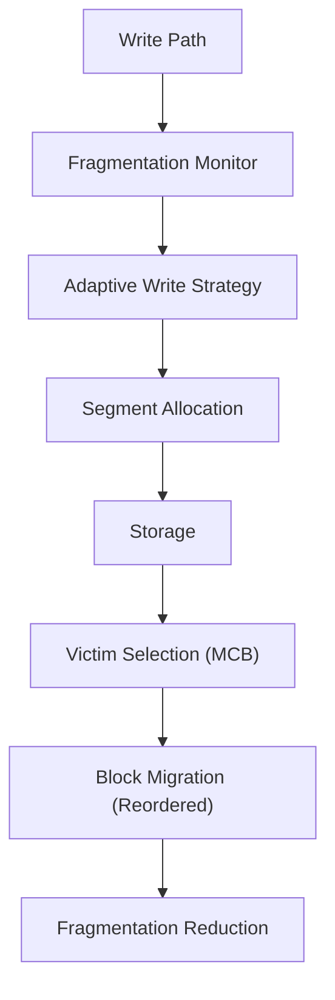

# 🚀 F2FS Garbage Collection Optimization (FDGC)

This project implements a **fragmentation-aware garbage collection (GC) optimization framework** for the Flash-Friendly File System (F2FS), aiming to improve system performance, reduce write amplification, and enhance SSD endurance.

---

## 📌 Background

F2FS is a flash-optimized file system designed based on the Log-Structured File System (LFS) principle, where all writes are performed sequentially to improve performance on NAND flash storage. :contentReference[oaicite:0]{index=0}

However, despite its advantages, F2FS still suffers from several critical issues in real-world workloads:

- ❗ Inefficient garbage collection (GC) causing I/O jitter and latency spikes  
- ❗ Severe **file fragmentation** and **space fragmentation** over time  
- ❗ Hot and cold data mixing leading to poor locality  
- ❗ Increased write amplification and energy consumption  

---

## 🎯 Objective

This project proposes **FDGC (Fragmentation-aware Defragmentation Garbage Collection)** to:

- Reduce fragmentation (file + space)
- Improve sequential read performance
- Reduce GC overhead and write amplification
- Improve overall system stability under mixed workloads

---

## 💡 Key Contributions

### 1. Fragmentation-aware Victim Selection (MCB)

Enhances the traditional Cost-Benefit (CB) model by introducing fragmentation:

Benefit = w1 * invalid_blocks + w2 * age + w3 * fragmentation


- Prioritizes highly fragmented segments
- Improves GC effectiveness beyond valid block ratio

---

### 2. Inode-based Block Migration Optimization

During GC:

- Valid blocks are **grouped by inode**
- Sorted by **file offset**
- Rewritten sequentially into new segments

📌 Effect:
- Restores file-level spatial locality
- Improves sequential read performance
- Reduces future fragmentation

---

### 3. Adaptive Write Mode Switching

Dynamically adjusts write behavior based on fragmentation level:

| Fragmentation Level | Strategy |
|--------------------|----------|
| Low                | More append writes |
| Medium             | Hybrid (append + in-place) |
| High               | Force in-place update |

📌 Effect:
- Prevents further fragmentation
- Stabilizes performance under heavy load

---

## 🏗️ System Architecture



---

## ⚙️ Implementation Details

### Modified Components

| Module | Description |
|------|------------|
| `gc.c` | Victim selection + migration optimization |
| `segment.c` | Zone-based allocation |
| `data.c` | Write path modification |
| `f2fs.h` | Metadata extensions |

---

### Key Functions

| Function | Purpose |
|---------|--------|
| `get_gc_victim()` | Fragmentation-aware segment selection |
| `calculate_fragmentation_level()` | Fragment metric computation |
| `add_block_to_inode_bucket()` | Collect blocks by inode |
| `flush_inode_buckets()` | Sequential migration |
| `move_data_block()` | Modified migration logic |

---

## 🧪 Evaluation

Experiments were conducted under multiple workloads (sequential, random, mixed):

### 🔹 Key Results

| Metric | Improvement |
|------|------------|
| GC trigger count | ↓ 15% ~ 26% |
| Fragmentation rate | ↓ 35.6% ~ 40.4% |
| Sequential read performance | ↑ 38% ~ 57% |
| Average latency | ↓ 3% ~ 24% |

📌 Note:
- Minor overhead (0.2% ~ 1.3%) observed in random workloads due to extra computation

---

## 🧪 Workload Design

- Sequential write + random overwrite
- Multi-threaded concurrent writes
- Mixed hot/cold data workloads

Tools used:
- `fio`
- custom GC test scripts

---

## 🚧 Limitations

- Additional CPU overhead during GC
- Requires kernel-level modification
- Random workload improvement is limited

---

## 📂 Repository Structure

```text
F2FS/
├── GC/                         # Garbage collection related implementation and notes
├── Linux Kernel Versions.md    # Kernel version compatibility / environment notes
├── NZF2FS.c                    # Main optimization implementation source
├── Setup.md                    # Environment setup and usage instructions
├── raw_result.md               # Raw experimental results
└── README.md                   # Project overview
```

---

## 🔮 Future Work

- ML-based adaptive GC policy
- More accurate fragmentation metrics
- Integration with SSD-level FTL hints
- Cross-layer optimization (FS + device)

---

## 📖 References

[1] Lee C, Sim D, Hwang J Y, et al. F2FS: A New File System for Flash Storage[C]. 
    In: Proceedings of the 13th USENIX Conference on File and Storage Technologies (FAST 2015), 
    Santa Clara, CA, USA, February 16–19, 2015. USENIX Association, 2015: 273–286.

[2] Rosenblum M, Ousterhout J K. The Design and Implementation of a Log-Structured File System[J]. 
    ACM Transactions on Computer Systems, 1992, 10(1): 26–52.

[3] Lee S W, Moon B, Park C, et al. A Case for Flash Memory SSD in Enterprise Database Applications[C]. 
    In: Proceedings of the 2008 ACM SIGMOD International Conference on Management of Data (SIGMOD 2008). 
    New York, NY, USA: ACM, 2008: 1075–1086.

[4] Lu Y, Shu J, Wang W. ReconFS: A Reconstructable File System on Flash Storage[C]. 
    In: Proceedings of the 12th USENIX Conference on File and Storage Technologies (FAST 2014). 
    Santa Clara, CA, USA: USENIX Association, 2014: 75–88.

[5] Min C, Kim K, Cho H, et al. SFS: Random Write Considered Harmful in Solid State Drives[C]. 
    In: Proceedings of the 10th USENIX Conference on File and Storage Technologies (FAST 2012). 
    San Jose, CA, USA: USENIX Association, 2012: 1–16.

[6] Chen F, Koufaty D A, Zhang X. Understanding Intrinsic Characteristics and System Implications 
    of Flash Memory Based Solid State Drives[J]. ACM SIGMETRICS Performance Evaluation Review, 
    2009, 37(1): 181–192.

[7] Gupta A, Pisolkar R, Urgaonkar B, et al. Leveraging Value Locality in Optimizing NAND Flash-Based SSDs[C]. 
    In: Proceedings of the 9th USENIX Conference on File and Storage Technologies (FAST 2011). 
    Berkeley, CA, USA: USENIX Association, 2011: 91–103.

[8] Lv H, Zhou Y, Wu F, et al. Exploiting Minipage-Level Mapping to Improve Write Efficiency of NAND Flash[C]. 
    In: Proceedings of the 2018 IEEE International Conference on Networking, Architecture and Storage (NAS 2018). 
    Chongqing, China: IEEE, 2018: 1–10.

[9] Ji C, Chang L, Shi L, et al. An Empirical Study of File-System Fragmentation in Mobile Storage Systems[C]. 
    In: Proceedings of the 8th USENIX Workshop on Hot Topics in Storage and File Systems (HotStorage 2016). 
    Denver, CO, USA: USENIX Association, 2016: 76–80.

[10] Mohan J, Kadekodi R, Chidambaram V. Analyzing IO Amplification in Linux File Systems[EB/OL]. 
     arXiv preprint arXiv:1707.08514, 2017.

[11] Lee S, Shin D, Kim Y J. LAST: Locality-Aware Sector Translation for NAND Flash Memory-Based Storage Systems[J]. 
     ACM SIGOPS Operating Systems Review, 2008.

[12] Choi J, Lee S, Kim Y, et al. MTI: Multi-Level Temperature Identification for Flash-Aware Garbage Collection[C]. 
     In: Proceedings of the 2019 IEEE International Conference on Computer Design (ICCD 2019). 
     Seoul, South Korea: IEEE, 2019: 1–8.
